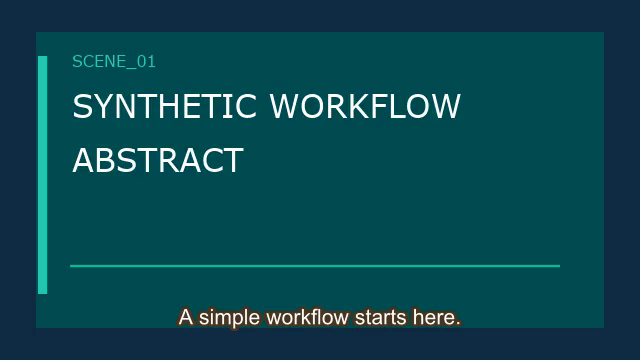
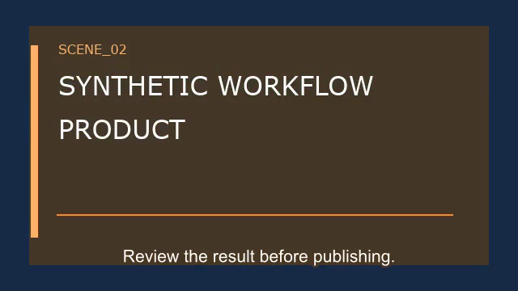

# AI Video Workflow Engine

**A reproducible video-workflow engine from asset checks to a real FFmpeg render and human QA gate.** It solves the handoff problem where a file exists but the inputs, failure state or approval are unclear.

**OFFLINE_ENGINEERING_DEMO / HUMAN_REVIEW** · [Watch synthetic MP4](examples/demo-output.mp4) · [Case study](docs/case-study.md) · [Resume bullets](docs/resume-bullets.md) · [Interview notes](docs/interview-notes.md)

[](https://github.com/zhouey314-cloud/ai-video-workflow-engine/actions/workflows/ci.yml)



Independent clean-room framework for synthetic video production. No company pipeline source, customer media, voice data, internal prompt or paid provider call is included.


## Demo and quick start

Python 3.10+: `python3 -m unittest discover -s tests -v`; `python3 -m video_workflow.cli`. The mock run writes `output/demo.json` and `output/report.json`. The real synthetic FFmpeg run:

```bash
python3 -m video_workflow.cli --provider ffmpeg --media-output examples/demo-output.mp4 --output examples/demo-qa.json
```

This walks synthetic input → storyboard → asset-tag retrieval → timeline → two distinct title-card shots → burned test subtitles + generated tone → render → ffprobe QA → human-review gate. [Watch the 6-second synthetic MP4](examples/demo-output.mp4) (72 KB). [Opening frame](examples/demo-output.png) · [closing frame](examples/demo-frame-2.png) · [captions](examples/demo-output.srt) · [timeline](examples/demo-output.timeline.json) · [QA report](examples/demo-qa.json). To reproduce the closing frame: `ffmpeg -ss 4 -i examples/demo-output.mp4 -frames:v 1 examples/demo-frame-2.png`. `--provider external` remains `NOT_CONFIGURED` and fails closed.




## Problem, architecture and features

Input → Script → Persona/Grounding → Storyboard → licensed synthetic material retrieval → gap detection → optional generation request → timeline plan → render adapter → QA → human review. The implementation models each state, validates a storyboard, checks license and synthetic tags, records failures, enforces a zero dollar budget and requires a named human to approve. See [architecture](docs/architecture.md), [sample storyboard](examples/storyboard.json) and [sample report](examples/sample-report.json).

## Verification and boundaries

25 deterministic tests cover state, retrieval, missing material, real FFmpeg render, media stream/duration QA, provider configuration and review gates. `HUMAN_REVIEW` means a mechanical QA pass, not video quality approval. The committed MP4 was visually spot-checked at opening/closing frames; it has not been approved by an external reviewer. There is no AI model eval or paid video API. All examples are `synthetic_unverified`; real footage and publishing are outside scope. See [resume bullets](docs/resume-bullets.md) and [interview notes](docs/interview-notes.md).

## Roadmap and license

Add real storyboard visual validation, frame/audio QA and provider cost receipts before production integration. MIT.
